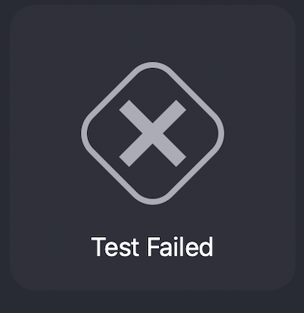
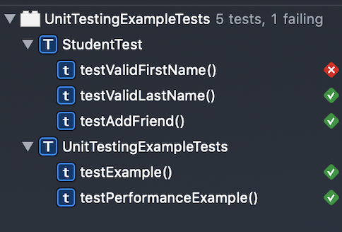
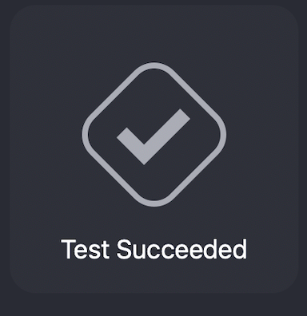
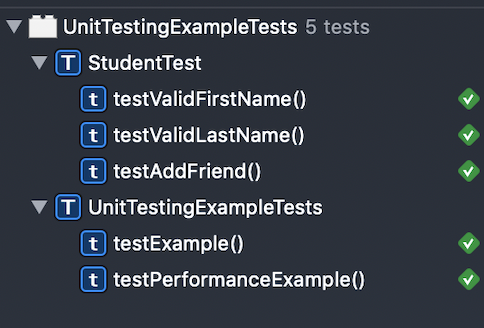

# UnitTestingExample

### Unit Testing Example in iOS

###### This example covers the basics unit testing and test driven development in iOS.

###### Shorten the `firstName` in `StudentTest.swift` folder to make the test fail.

---

---

###### Expand the `firstName` again in `StudentTest.swift` folder to make the test pass.

---

---

###### I used the `XCTest` framework and build and run our own `XCTestCases`. We always have to thinking about ways to improve our code safety and reliability.
